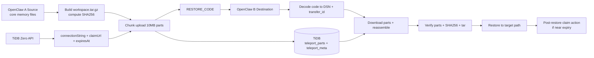

# OpenClaw Memory Teleport Skill

Portable backup/restore skills for migrating OpenClaw memory/persona state across machines.

## Overview
This repo provides a shell-based migration flow:
1. Backup on source machine
2. Upload payload to TiDB/MySQL (`teleport_parts` table)
3. Restore in-place on destination machine

It restores real memory/persona files (not just DB row export).

## Included Skills
- `skills/agent_teleport_backup/SKILL.md` — source-side backup/upload
- `skills/agent_teleport_restore/SKILL.md` — destination-side in-place restore

## Data Flow (Quick Understanding)


What this gives users quickly:
- Reliable transport: chunked upload/download with retry-safe writes.
- Integrity safety: restore verifies part consistency and SHA256 before extract.
- Lifecycle clarity: backup/restore expose `expiresAt` and `claimUrl` with claim guidance.
- Better waiting UX: long steps emit heartbeat/progress updates, not silent waits.

## Copy/Paste Quick Start

> Run on **OpenClaw A** (source), then run on **OpenClaw B** (destination).

### Recommended (extreme simplicity)
No extra setup, no passphrase input, just URL prompts.
Backup returns one restore code (`RESTORE-...`) and restore accepts it directly.
Before backup starts, it shows folder-size tree, but backup scope is now fixed to memory/persona only (`MEMORY.md`, `memory/`, `SOUL.md`, `USER.md`, `IDENTITY.md`, `TOOLS.md`). Full workspace backup is intentionally disabled.

For large project/code directories, use GitHub sync (clone/pull) instead of Teleport backup.
If archive is larger than 10MB, backup auto-splits into multiple DB parts; restore auto-downloads all parts and reassembles.

```text
# A: backup
https://github.com/lilyjazz/openclaw-memory-teleport-skill/blob/main/skills/agent_teleport_backup/SKILL.md
Use this skill to back up OpenClaw’s memory.
After backup, output the restore handoff with the real code for OpenClaw B.
```

```text
# B: restore
https://github.com/lilyjazz/openclaw-memory-teleport-skill/blob/main/skills/agent_teleport_restore/SKILL.md
Use this skill to restore OpenClaw’s memory.
🔐 Restore Code: RESTORE-...
```

## Requirements
### Backup side
- `bash`, `tar`, `curl`, `sed`, `awk`, `base64`
- `node`, `npx` (uses `mysql2` package automatically)

### Restore side
- `bash`, `tar`, `date`, `mktemp`, `base64`
- `node`, `npx` (uses `mysql2` package automatically)

## Troubleshooting
- **DSN copied with spaces/newlines**: keep `DSN_RAW` and sanitize via `tr -d '[:space:]'` (already in example).
- **`npx` install blocked**: ensure outbound npm access or preinstall `mysql2` in your environment.
- **`payload not found`**: DSN wrong, DB wrong, or `teleport.id=1` missing.
- **`parts count mismatch` / `meta parts mismatch`**: transfer rows incomplete or mixed; rerun backup upload and use the new restore code.
- **`sha256 mismatch`**: payload corrupted or wrong transfer; rerun download (Step 4) or regenerate backup.
- **archive too large**: clean caches/build outputs and retry backup.
- **`expiresAt` is near / already passed**: claim immediately with `claimUrl` (if available), otherwise re-run backup to get a fresh Zero instance.

## Security Notes
- DSN is a restore key (secret).
- Never share DSN in public channels.
- Delete/rotate temporary DB resources after restore for sensitive data.

## Maintainer
GitHub: [@lilyjazz](https://github.com/lilyjazz)
